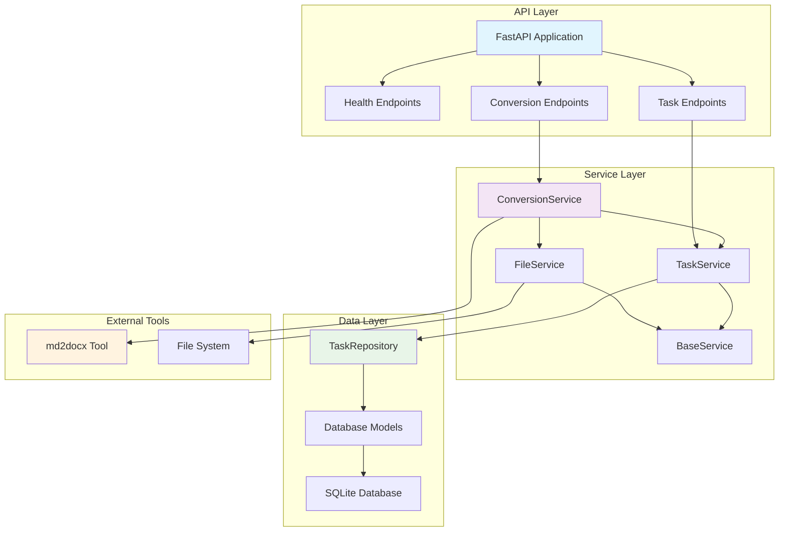
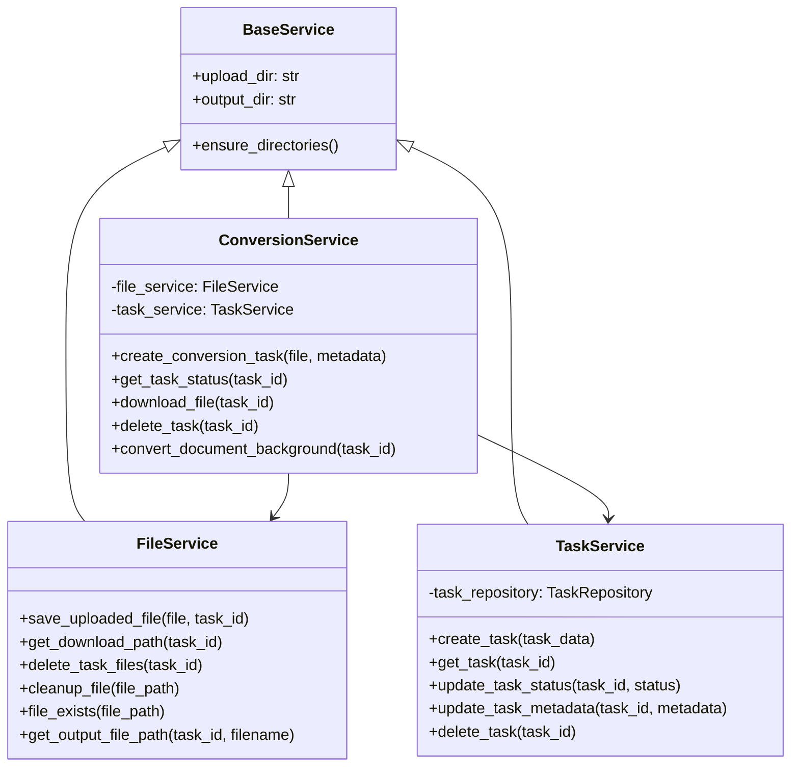
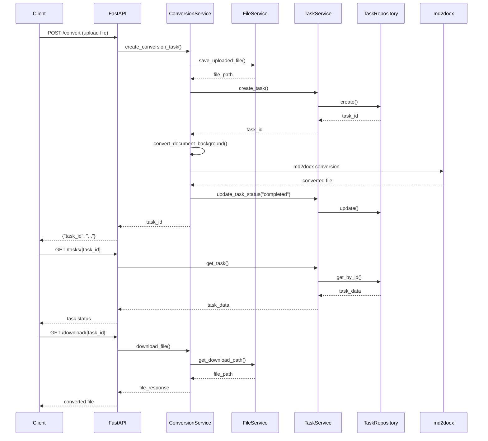
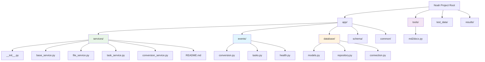
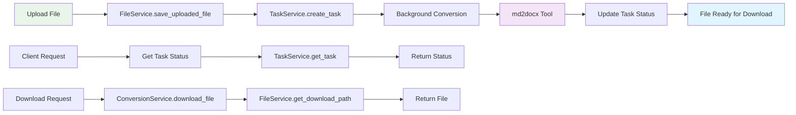

## 文件说明

这是一个将Markdown文件转换为Microsoft Word (.docx)文档的工具，具有特殊的图表渲染支持。该工具可以识别并渲染嵌入在Markdown中的各种图表（Mermaid、Vega、Vega-Lite），并将它们作为高质量图像嵌入到生成的Word文档中。此外，它还支持自定义文本格式化，如将Unicode颜色图标转换为彩色文本。

主要文件：
- `tools/md2docx.py`: 核心转换工具的实现
- `tools/md2docx.md`: LangChain函数调用风格的工具文档，详细说明了工具的使用方法和参数
- `parser.py`: 命令行接口
- `test.py`: 批量处理测试脚本
- `test_data/`: 测试用的Markdown文件
- `results/`: 生成的Word文档输出目录

## 功能特点

* 将Markdown转换为DOCX格式
* 渲染Mermaid、Vega和Vega-Lite图表为PNG图像并嵌入到文档中
* 将特定的Unicode颜色图标（如🟢、🟡、🔴、⚪）转换为Word文档中的彩色圆圈表示
* 为表格应用完整的网格边框
* 移除Pandoc生成的书签（可选）
* 提供命令行接口，便于集成到工作流程中

## 风险和注意事项

### Mermaid图表渲染

1. **需要联网**: Mermaid库使用在线API（https://mermaid.ink）来渲染图表。如果没有互联网连接，图表渲染将失败。

2. **API依赖**: 依赖第三方服务（mermaid.ink）可能带来以下风险：
   - 服务可能不稳定或变更
   - 可能有请求限制
   - 图表内容会被发送到第三方服务器

3. **Graphviz依赖**: 某些复杂的Mermaid图表（如`graph TD`类型）可能需要安装Graphviz才能正确渲染。

### IPython警告

1. **警告信息**: 运行时可能会看到以下警告：
   ```
   Warning: IPython is not installed. Mermaidjs magic function is not available.
   ```

2. **原因**: 这个警告来自Mermaid库，当它尝试导入IPython但未安装时显示。虽然已在requirements.txt中添加了IPython依赖，但实际上本工具并不使用IPython的魔法函数功能。

3. **解决方案**: 
   - 可以忽略此警告，它不影响工具的主要功能
   - 已在requirements.txt中添加了ipython>=8.0.0，安装依赖后警告将消失

## 环境要求

* **Python 3.x**
* **Pandoc**: 确保Pandoc已安装并可在系统PATH中访问。可从[pandoc.org](https://pandoc.org/installing.html)下载。
* **uv**: 本项目使用`uv`进行Python环境和包管理。按照[uv.astral.sh](https://uv.astral.sh/introduction/)的说明安装`uv`。
* **Graphviz** (可选): 如果计划使用复杂的Mermaid图表，可能需要安装Graphviz。

## 使用uv安装和部署环境

### 安装uv

#### Windows
```powershell
# 使用PowerShell安装
irm https://astral.sh/uv/install.ps1 | iex
```

#### macOS/Linux
```bash
# 使用curl安装
curl -fsSL https://astral.sh/uv/install.sh | sh
```

### 创建和激活虚拟环境

```bash
# 创建名为'noahenv'的虚拟环境
uv venv noahenv

# 在Linux/macOS上激活
source noahenv/bin/activate

# 在Windows上激活(Command Prompt)
noahenv\Scripts\activate

```

### 安装依赖

```bash
# 使用requirements.txt安装所有依赖
uv pip install -r requirements.txt
```

或者单独安装：
```bash
uv pip install pypandoc altair mermaid python-docx ipython
```

## LangChain函数调用集成

本项目的`md2docx`工具是使用LangChain函数调用风格编写的，这意味着它可以轻松集成到基于LangChain的应用程序中，特别是与大型语言模型(LLM)一起使用时。

### 作为LangChain工具使用(未测试)

```python
from langchain.agents import initialize_agent, AgentType
from langchain.llms import OpenAI
from tools.md2docx import get_markdown_to_word_tool

# 获取工具实例
markdown_to_word_tool = get_markdown_to_word_tool()

# 创建LLM
llm = OpenAI(temperature=0)

# 初始化代理
agent = initialize_agent(
    [markdown_to_word_tool],
    llm,
    agent=AgentType.STRUCTURED_CHAT_ZERO_SHOT_REACT_DESCRIPTION,
    verbose=True
)

# 使用代理执行任务
result = agent.run(
    "将'example.md'转换为Word文档，并保存为'output.docx'"
)
print(result)
```

### 直接调用工具(测试test.py)

```python
from tools.md2docx import get_markdown_to_word_tool

# 获取工具实例
markdown_to_word_tool = get_markdown_to_word_tool()

# 方法1：使用run方法（推荐）
result = markdown_to_word_tool.run({
    "input_path": "path/to/example.md",
    "output_path": "path/to/output.docx",
    "keep_bookmarks": False
})

# 方法2：使用_run方法（直接传参）
result = markdown_to_word_tool._run(
    input_path="path/to/example.md",
    output_path="path/to/output.docx",
    keep_bookmarks=False
)

print(result)
```

更多详细信息和示例，请参阅`tools/md2docx.md`文档。

## 使用方法

### 命令行接口

从命令行运行脚本，提供输入Markdown文件和可选的输出文件路径。

```bash
python parser.py -i path/to/your/input.md -o path/to/your/output.docx
```

**参数：**

* `-i INPUT`, `--input INPUT`: (必需) 输入Markdown文件的路径。
* `-o OUTPUT`, `--output OUTPUT`: (可选) 输出Word文件的路径。如果未指定，输出文件将与输入文件同名但扩展名为`.docx`，保存在与输入文件相同的目录中。

**示例：**

```bash
python parser.py -i test_data/example.md -o results/example_output.docx
```

### 批量处理

使用`test.py`脚本可以批量处理`test_data`目录下的所有Markdown文件：

```bash
python test.py
```

这将处理`test_data`目录中的所有`.md`文件，并将结果保存到`results`目录中。

## 工作原理

1. 脚本使用`pypandoc`将输入的Markdown文件解析为抽象语法树(AST)。
2. 它识别`mermaid`、`vega`和`vega-lite`的代码块。
3. 这些图表使用`mermaid`和`altair`库分别渲染为PNG图像。图像保存在临时目录中。
4. AST被转换：图表代码块被替换为渲染图像的链接，特殊的颜色图标被转换为样式化文本。
5. `pypandoc`将修改后的AST转换为`.docx`文件。
6. (可选) 如果安装了`python-docx`，脚本会进一步格式化.docx文件，确保表格有完整的边框并移除书签。
7. 清理包含渲染图像的临时目录。

## 故障排除

* **Pandoc错误**: 确保Pandoc已正确安装并在PATH中。尝试在命令行中运行`pandoc --version`来验证。
* **Mermaid图表错误/`mmdc`未找到**: 确保`@mermaid-js/mermaid-cli`已安装（通常通过`npm`）并且`mmdc`在PATH中。一些复杂的Mermaid图表可能还需要Graphviz。
* **IPython警告**: 如前所述，可以忽略或通过安装IPython解决。
* **网络连接问题**: 确保有互联网连接以渲染Mermaid图表。

# 文档转换服务
这是一个基于 Python 和 FastAPI 构建的强大且灵活的文档转换服务。


## System Overview



## Service Layer Architecture



## Request Flow Diagram



## File System Structure



## Data Flow



## Key Design Principles

1. **Separation of Concerns**: Each service has a specific responsibility
2. **Dependency Injection**: Services depend on abstractions, not concrete implementations
3. **Single Responsibility**: Each class has one reason to change
4. **Domain-Driven Design**: Services are organized around business domains
5. **Backward Compatibility**: Legacy imports are maintained through the services package

## Benefits

- **Testability**: Each service can be tested in isolation
- **Maintainability**: Clear separation makes code easier to understand and modify
- **Scalability**: New services can be added without affecting existing ones
- **Reusability**: Services can be reused across different parts of the application
## 许可证

[MIT](LICENSE)