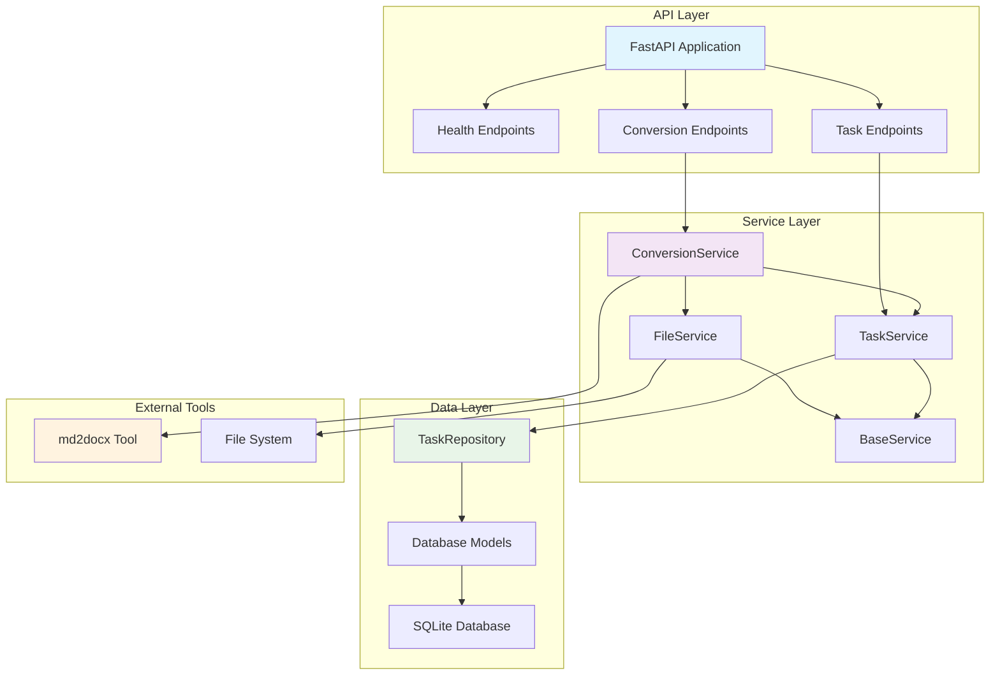
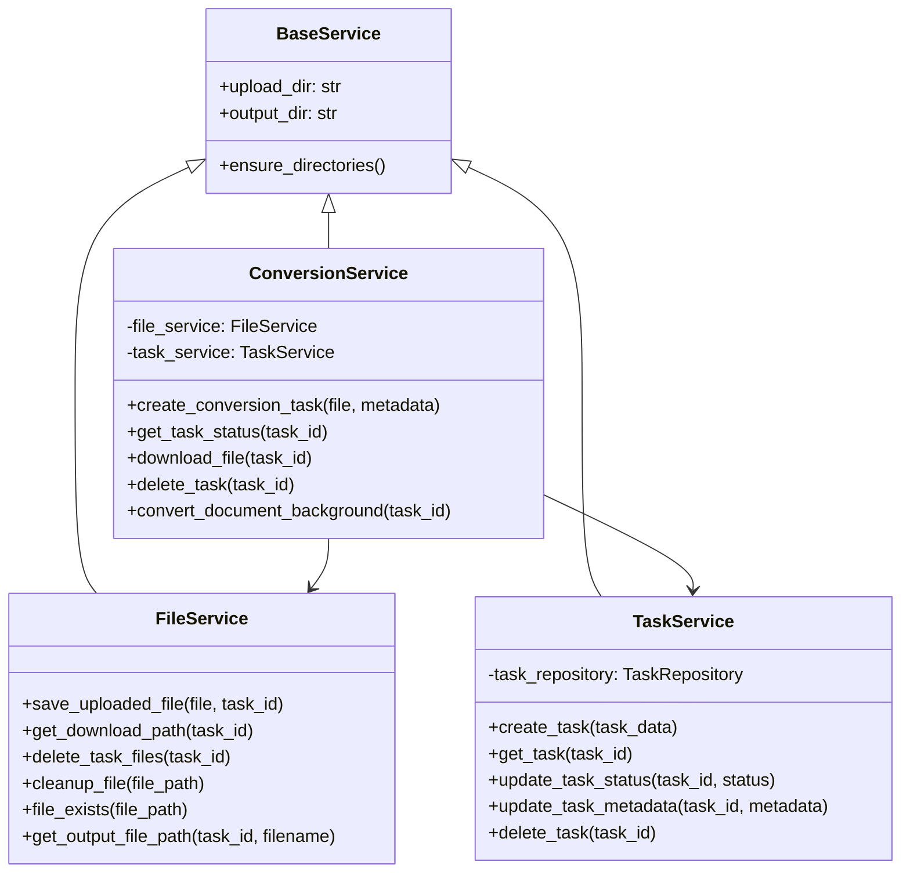
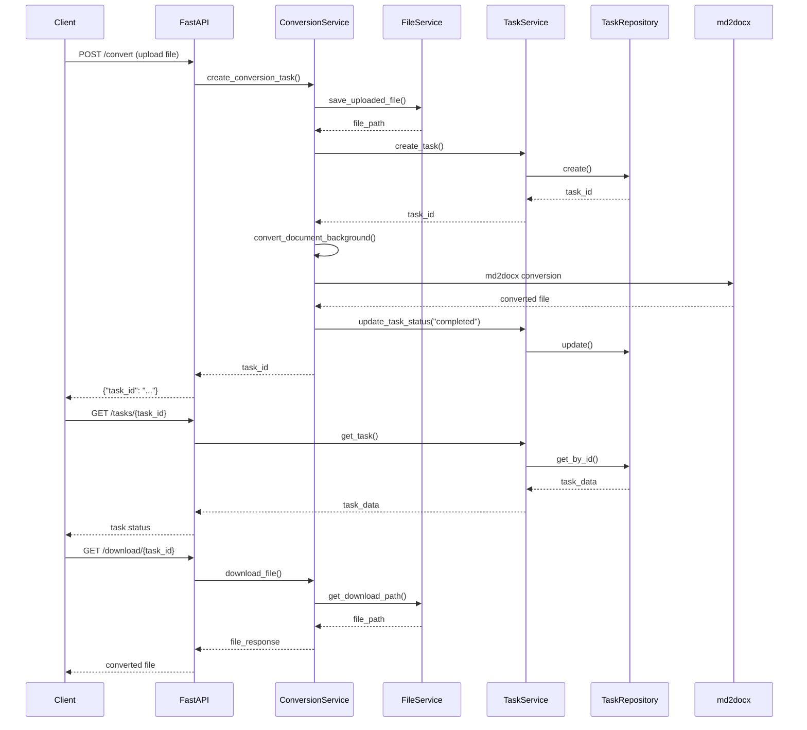
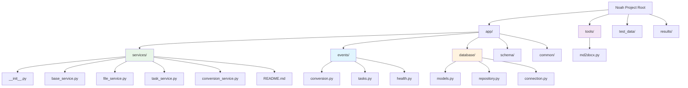
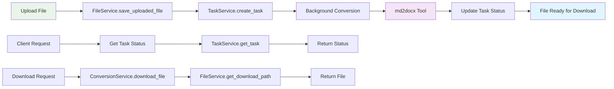

# Noah System Architecture

This document provides a visual overview of the Noah document conversion system architecture using Mermaid diagrams.

## System Overview

## Service Layer Architecture

## Request Flow Diagram

## File System Structure

## Data Flow

## Key Design Principles

1. **Separation of Concerns**: Each service has a specific responsibility
2. **Dependency Injection**: Services depend on abstractions, not concrete implementations
3. **Single Responsibility**: Each class has one reason to change
4. **Domain-Driven Design**: Services are organized around business domains
5. **Backward Compatibility**: Legacy imports are maintained through the services package

## Benefits

- **Testability**: Each service can be tested in isolation
- **Maintainability**: Clear separation makes code easier to understand and modify
- **Scalability**: New services can be added without affecting existing ones
- **Reusability**: Services can be reused across different parts of the application