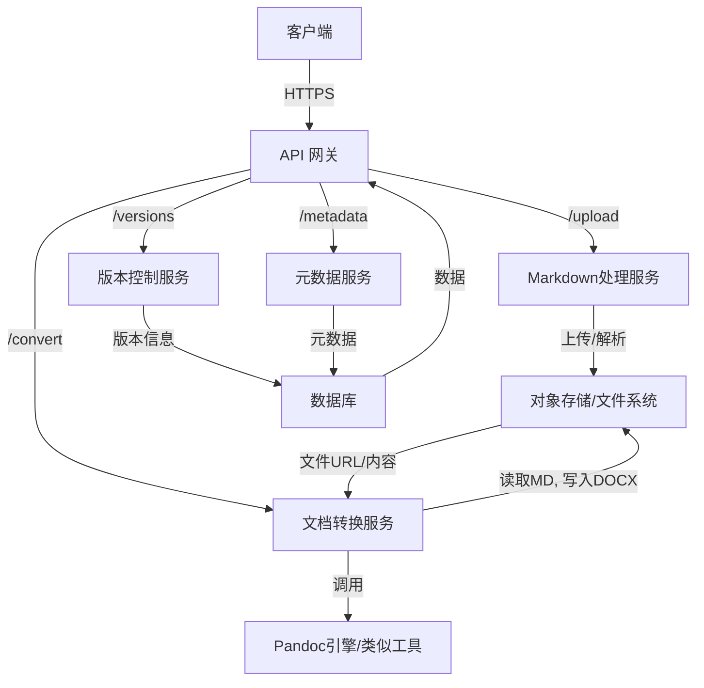
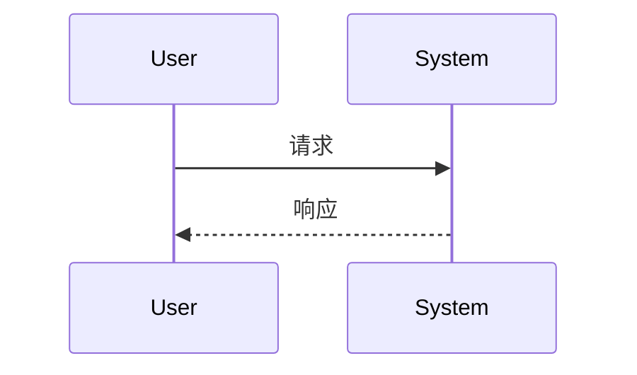

# 备选功能设计与架构文档

## 1. 文档信息

### 1.1 版本历史

| 版本 | 日期       | 作者    | 变更说明         |
| ---- | ---------- | ------- | ---------------- |
| 0.1  | (填写日期) | (填写作者) | 初稿             |

### 1.2 文档目的

(请在此处填写本文档的目的，例如：为某个新功能模块或现有功能的备选方案提供详细的功能设计和系统架构说明。)

### 1.3 相关文档引用

- (例如：API_PRD.md)
- (例如：Function_Design_And_Architecture.md - 作为参考或对比)

## 2. 系统架构

### 2.1 架构概述

本备选方案提议一个基于微服务架构的文档处理API。核心功能是将Markdown文件转换为DOCX，同时提供版本控制和元数据管理。API将通过API网关暴露。



### 2.2 主要组件

-   **API 网关**: 统一入口，负责请求路由、认证、限流、日志。
-   **Markdown 处理服务**: 负责接收上传的Markdown文件，进行初步校验和解析，存入存储系统。
-   **文档转换服务**: 核心服务，调用底层转换引擎（如Pandoc）将Markdown转换为DOCX。处理转换队列和状态。
-   **版本控制服务**: 管理文档的不同版本，支持版本回溯和比较 (未来扩展)。
-   **元数据服务**: 管理文档的元数据，如作者、创建日期、标签等。
-   **对象存储/文件系统**: 存储原始Markdown文件和转换后的DOCX文件。
-   **数据库**: 存储文档版本信息、元数据、用户信息等。
-   **Pandoc引擎/类似工具**: 实际执行文档格式转换的工具。

## 3. API 接口设计

### 3.1 上传Markdown文件并触发转换

-   **方法**: `POST`
-   **端点**: `/api/v1/documents/convert`
-   **描述**: 上传一个Markdown文件，系统将异步进行转换，并返回一个任务ID用于查询状态。
-   **请求头**:
    -   `Authorization: Bearer <token>`
    -   `Content-Type: multipart/form-data`
-   **请求体 (form-data)**:
    -   `file`: (必需) 用户上传的 Markdown 文件 (`.md`)。
    -   `output_filename`: (可选)期望的输出DOCX文件名 (不含扩展名)。如果未提供，则基于输入文件名生成。
    -   `metadata`: (可选, JSON字符串) 文档元数据，例如 `{"author": "John Doe", "tags": ["report", "draft"]}`。
-   **成功响应 (202 Accepted)**:
    -   **Content-Type**: `application/json`
    -   **Body (Schema)**:
        ```json
        {
          "task_id": "string (UUID)",
          "status_url": "string (URL to check conversion status)",
          "message": "File uploaded successfully. Conversion started."
        }
        ```
-   **错误响应**:
    -   `400 Bad Request`: 输入无效 (如未上传文件、文件类型错误、元数据JSON格式错误)。
    -   `401 Unauthorized`: 未授权。
    -   `413 Payload Too Large`: 文件过大。
    -   `500 Internal Server Error`: 服务器内部错误。

### 3.2 查询转换任务状态

-   **方法**: `GET`
-   **端点**: `/api/v1/documents/convert/status/{task_id}`
-   **描述**: 根据任务ID查询文档转换的状态。
-   **请求头**:
    -   `Authorization: Bearer <token>`
-   **路径参数**:
    -   `task_id`: (必需, string) 转换任务的ID。
-   **成功响应 (200 OK)**:
    -   **Content-Type**: `application/json`
    -   **Body (Schema)**:
        ```json
        {
          "task_id": "string",
          "status": "string (e.g., PENDING, PROCESSING, COMPLETED, FAILED)",
          "created_at": "string (ISO 8601 datetime)",
          "updated_at": "string (ISO 8601 datetime)",
          "download_url": "string (URL to download DOCX, present if status is COMPLETED, nullable)",
          "error_message": "string (present if status is FAILED, nullable)"
        }
        ```
-   **错误响应**:
    -   `401 Unauthorized`: 未授权。
    -   `404 Not Found`: 任务ID不存在。
    -   `500 Internal Server Error`: 服务器内部错误。

### 3.3 下载转换后的DOCX文件

-   **方法**: `GET`
-   **端点**: `/api/v1/documents/download/{document_id}` (或者通过 `status_url` 中的 `download_url`)
-   **描述**: 下载已成功转换的DOCX文件。
-   **请求头**:
    -   `Authorization: Bearer <token>`
-   **路径参数**:
    -   `document_id`: (必需, string) 成功转换后文档的唯一标识符 (可能与task_id不同，或者由 `download_url` 提供)。
-   **成功响应 (200 OK)**:
    -   **Content-Type**: `application/vnd.openxmlformats-officedocument.wordprocessingml.document`
    -   `Content-Disposition: attachment; filename="<filename>.docx"`
    -   **Body**: DOCX文件的二进制内容。
-   **错误响应**:
    -   `401 Unauthorized`: 未授权。
    -   `404 Not Found`: 文档ID不存在或文件不可用。
    -   `500 Internal Server Error`: 服务器内部错误。

## 4. Schema 定义 (Pydantic-like)

下面是关键请求/响应体可能用到的数据模型 (类Pydantic风格)。

```python
from typing import Optional, List, Dict
from enum import Enum
from datetime import datetime

# --- Enums ---
class ConversionStatus(str, Enum):
    PENDING = "PENDING"
    PROCESSING = "PROCESSING"
    COMPLETED = "COMPLETED"
    FAILED = "FAILED"

# --- Request Schemas ---
class DocumentMetadata(BaseModel):
    author: Optional[str] = None
    title: Optional[str] = None
    tags: Optional[List[str]] = None
    custom_fields: Optional[Dict[str, str]] = None

# --- Response Schemas ---
class ConversionRequestResponse(BaseModel):
    task_id: str
    status_url: str
    message: str

class ConversionStatusResponse(BaseModel):
    task_id: str
    status: ConversionStatus
    created_at: datetime
    updated_at: datetime
    download_url: Optional[str] = None
    error_message: Optional[str] = None

```

## 5. 模块设计 (细化)

### 5.1 API网关模块

-   **职责**: 请求路由、认证 (JWT), 限流, 日志聚合。
-   **技术选型**: Nginx + Lua, Kong, Spring Cloud Gateway, 或云服务商提供的API Gateway。

### 5.2 Markdown处理服务模块

-   **职责**: 接收文件，初步校验 (大小、类型), 解析元数据 (如果内嵌或通过参数提供), 将文件存入对象存储，并创建转换任务记录。
-   **主要功能**: 文件上传接口, 元数据提取, 文件存储。
-   **技术实现**: FastAPI/Flask (Python), Spring Boot (Java)。

### 5.3 文档转换服务模块

-   **职责**: 监听转换任务队列，从对象存储拉取Markdown文件，调用Pandoc等工具进行转换，将结果存回对象存储，更新任务状态。
-   **主要功能**: 任务队列处理 (e.g., RabbitMQ, Kafka, Redis Streams), Pandoc调用封装, 错误处理与重试机制。
-   **技术实现**: Python (Celery + Pandoc), Go。

### 5.4 版本控制服务模块 (未来)

-   **职责**: 存储和管理文档的不同版本。
-   **主要功能**: 版本创建、版本列表、版本回溯。
-   **技术实现**: Git集成或自定义版本逻辑 + 数据库。

### 5.5 元数据服务模块

-   **职责**: 管理文档的结构化元数据。
-   **主要功能**: 元数据增删改查API。
-   **技术实现**: FastAPI/Flask + SQLAlchemy/MongoDB。
 

## 5. 数据流 (如果适用)

(请在此处描述数据流。如果适用，可以使用 Mermaid 图表。)



## 6. 与现有设计的差异点/优势

(请在此处阐述本设计方案与 `Function_Design_And_Architecture.md` 或其他现有设计相比的主要差异点、改进之处或特定优势。)

## 7. 其他考量

(例如：安全性、性能、部署、未来扩展等方面的特殊考量。)