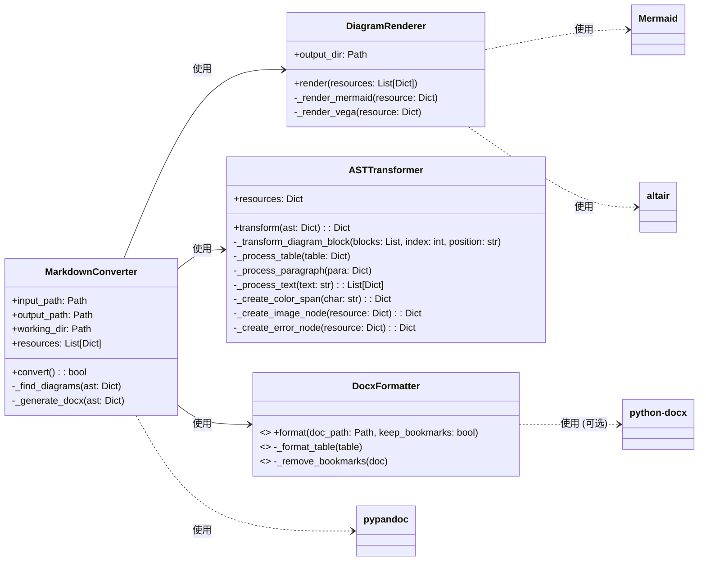

# md-to-word-converter 功能设计与架构

## 1. 概述

`parser.py` 脚本是一个命令行应用程序，旨在将 Markdown 文件转换为 Microsoft Word (.docx) 文档。其核心功能包括：

-   解析 Markdown 内容。
-   识别和渲染嵌入式图表（Mermaid、Vega、Vega-Lite）为图像。
-   转换文档的抽象语法树 (AST)，以嵌入这些渲染后的图表。
-   对表格（例如，确保完整边框）和文本内容（例如，将 "🟢" 等彩色 Unicode 图标转换为带颜色的文本）应用特定格式。
-   生成包含已处理内容和格式的 .docx 文件。

## 2. 架构

该应用程序采用模块化设计，将职责分离到不同的类中：

### 2.1. 核心类

*   **`MarkdownConverter`**: 这是转换过程的主要协调器。
    *   它初始化路径，管理用于中间文件（如渲染图像）的临时工作目录。
    *   `convert()` 方法驱动整个工作流程：读取输入、解析为 AST、查找和渲染图表、转换 AST、生成 DOCX，最后应用 DOCX 特定格式。
*   **`DiagramRenderer`**: 负责将图表代码块（Mermaid、Vega、Vega-Lite）渲染为图像文件 (PNG)。
    *   它接收一个由 `MarkdownConverter` 识别的图表资源列表。
    *   使用 `mermaid` 库处理 Mermaid 图表，使用 `altair` 库处理 Vega/Vega-Lite 图表。
    *   将渲染后的图像保存到临时工作目录。
*   **`ASTTransformer`**: 修改 Pandoc JSON AST。
    *   它将 AST 中的图表代码块替换为指向已渲染图表图像的图像节点。
    *   它处理表格单元格和段落，以查找特定的 Unicode 颜色图标（例如，“🟢”、“🟡”、“🔴”、“⚪”），并将它们转换为具有适当颜色样式的 AST `Span` 节点，从而有效地在输出文档中将它们渲染为彩色圆圈。
    *   如果图表渲染失败，它会在 AST 中创建一个错误节点以指示失败。
*   **`DocxFormatter`**: 使用 `python-docx` 库（如果可用）对生成的 .docx 文件执行后处理格式化。
    *   `_format_table()`: 确保文档中的所有表格都具有完整的单线网格边框。
    *   `_remove_bookmarks()`: 从文档中删除所有书签，Pandoc 默认情况下可能会为标题插入书签。

### 2.2. 关键库和依赖项

*   **`pypandoc`**: 用于将 Markdown 转换为 Pandoc 的 JSON AST 格式，然后再将此 AST 转换为 .docx 文件的核心库。
*   **`altair`**: 用于将 Vega 和 Vega-Lite 规范渲染为静态图像。
*   **`mermaid` (Python 库)**: 用于调用 Mermaid 渲染 Mermaid 图表语法。这可能与基于 JavaScript 的 Mermaid 渲染器接口。
*   **`python-docx`**: (可选，由 `DOCX_AVAILABLE` 标志控制) 用于在 Pandoc 初始生成后对 .docx 文件进行细粒度操作和格式化。这包括表格边框样式和书签删除。
*   **标准库**: `os`、`sys`、`json`、`hashlib`、`tempfile`、`shutil`、`argparse`、`pathlib`、`typing` 用于常规文件操作、参数解析、临时文件管理等。

## 3. 数据流和处理逻辑

1.  **初始化** (`MarkdownConverter.__init__`):
    *   解析命令行参数（`-i` 用于输入，`-o` 用于输出）。
    *   确定输入和输出文件路径。
    *   创建一个临时工作目录来存储中间文件（例如，渲染的图表图像）。

2.  **Markdown 到 AST** (`MarkdownConverter.convert()`):
    *   读取输入的 Markdown 文件。
    *   调用 `pypandoc.convert_text()` 将 Markdown 内容转换为 Pandoc 的 JSON AST 格式。使用 `--wrap=none` 参数防止 Pandoc 自动换行。

3.  **图表发现** (`MarkdownConverter._find_diagrams()`):
    *   遍历 AST（特别是 `blocks` 数组）以查找 `CodeBlock` 元素。
    *   对于每个 `CodeBlock`，检查指定的语言（例如，`mermaid`、`vega`、`vega-lite`）。
    *   如果找到支持的图表语言，则将其内容、类型、其内容的哈希值（用于唯一文件名）及其在 AST 中的位置存储在 `self.resources` 列表中。

4.  **图表渲染** (`DiagramRenderer.render()`):
    *   使用临时工作目录创建 `DiagramRenderer` 实例。
    *   它迭代上一步中收集的 `resources`。
    *   `_render_mermaid()`: 对于 Mermaid 图表，它使用 `mermaid` 库生成 PNG 图像。它应用基础宽度和缩放因子以提高复杂图表的清晰度。
    *   `_render_vega()`: 对于 Vega/Vega-Lite 图表，它使用 `altair` 生成 PNG 图像，并使用 `scale_factor` 和 `dpi` 设置来增强分辨率。
    *   渲染图像的路径存储回 `resource` 字典中。
    *   如果渲染失败，则在资源中设置 `error` 标志。

5.  **AST 转换** (`ASTTransformer.transform()`):
    *   使用（现已更新图像路径的）`resources` 创建 `ASTTransformer` 实例。
    *   它迭代 AST 的块。
    *   **图表替换** (`_transform_diagram_block()`): 如果块的位置与资源匹配，则将其替换。
        *   如果图表成功渲染（`resource['output']` 存在），则在 AST 中创建一个指向已渲染 PNG 的 `Image` 节点 (`_create_image_node()`)。
        *   如果渲染失败，则创建一个错误 `Div` 节点 (`_create_error_node()`)，其中包含原始图表代码和错误消息。
    *   **表格和文本格式化** (`_process_table()`、`_process_paragraph()`、`_process_text()`):
        *   如果块是 `Table`，则遍历其单元格。
        *   处理单元格内的段落 (`Para`)。
        *   检查段落内的字符串 (`Str`) 元素是否包含颜色图标 (🟢, 🟡, 🔴, ⚪)。
        *   `_create_color_span()`: 如果找到图标，则将其替换为具有相应颜色样式的 `Span` 元素，从而有效地将图标渲染为彩色圆点。

6.  **AST 到 DOCX 生成** (`MarkdownConverter._generate_docx()`):
    *   如果输出目录不存在，则创建它。
    *   再次调用 `pypandoc.convert_text()`，这次将修改后的 JSON AST 转换为 `docx` 格式。
    *   `--standalone` 确保创建一个完整的文档。
    *   `--resource-path={self.working_dir}` 告诉 Pandoc 在哪里可以找到链接的资源，例如渲染的图像。

7.  **DOCX 后期格式化** (`DocxFormatter.format()`):
    *   如果 `python-docx` 可用且 .docx 文件存在，则将其打开。
    *   `_format_table()`: 遍历所有表格，并为它们及其单元格应用标准的单线网格边框。
    *   `_remove_bookmarks()`: 遍历文档元素并删除任何 `bookmarkStart` 和 `bookmarkEnd` 标签，以消除自动生成的书签。
    *   修改后的文档保存回输出路径。

8.  **清理** (`MarkdownConverter.convert()` - `finally` 块):
    *   使用 `shutil.rmtree()` 删除临时工作目录及其所有内容（渲染的图像）。

## 4. 命令行界面

该脚本使用 `argparse` 来定义和解析命令行参数：

*   `-i` 或 `--input` (必需): 指定输入 Markdown 文件的路径。
*   `-o` 或 `--output` (可选): 指定输出 .docx 文件的路径。如果未提供，则默认为与输入文件同名但在同一目录中且扩展名为 `.docx` 的文件。

## 5. 错误处理

-   **导入错误**: `python-docx` 导入周围的 `try-except` 块允许脚本在没有它的情况下运行，尽管格式化功能会减少（如果未找到 `python-docx`，则会打印一条消息）。
-   **图表渲染错误**: `DiagramRenderer.render()` 方法捕获单个图表渲染期间的异常，打印错误消息，并在资源中设置 `error` 标志。然后 `ASTTransformer` 会在文档中插入一个错误消息块而不是图像。
-   **常规转换错误**: 主 `MarkdownConverter.convert()` 方法有一个 `try-except` 块来捕获转换过程中的任何其他异常，打印错误消息，如果 `convert()` 返回 `False`，则以非零状态代码退出。
-   **文件操作**: 隐式使用标准 Python 文件 I/O 错误处理。
-   **清理**: `finally` 块确保即使在转换过程中发生错误，也会删除临时工作目录。

## 6. 设计注意事项和优势

-   **模块化**: 将关注点清晰地分离到不同的类中，使代码更易于理解、维护和扩展。
-   **AST 操作**: 直接使用 Pandoc 的 AST 可以对输出文档结构和内容进行细粒度控制，从而实现自定义图标格式化和精确图像嵌入等功能。
-   **支持多种图表类型**: 该架构允许在需要时相对轻松地扩展以支持其他图表工具，方法是向 `DiagramRenderer` 添加新的渲染方法并更新 `MarkdownConverter._find_diagrams()`。
-   **高质量图表输出**: 在图表渲染期间使用特定参数（例如，`scale_factor`、`dpi`）来提高嵌入图表的视觉质量。
-   **强大的临时文件管理**: 确保正确清理中间文件。
-   **优雅降级**: 对 `python-docx` 的可选依赖意味着如果未安装它，核心转换仍然可以运行，尽管会跳过高级格式化。

## 7. 未来潜在的改进领域

-   **配置文件**: 用于更复杂的设置（例如，默认图表比例、图标颜色），而不是硬编码。
-   **更多图表类型**: 添加对 PlantUML、Ditaa 等的支持。
-   **可自定义的 DOCX 样式**: 允许用户指定 Word 模板或更详细的样式选项。
-   **错误报告**: 在输出文档中为失败的图表提供更详细的错误报告。
-   **缓存**: 如果渲染图表的源内容未更改，则缓存它们以加快重复转换的速度。